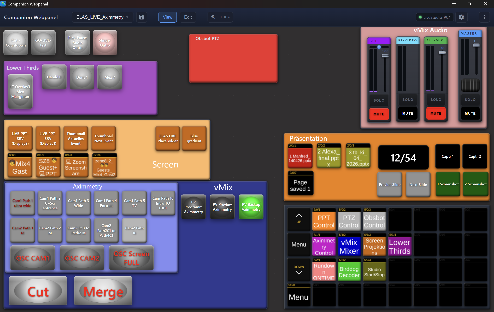
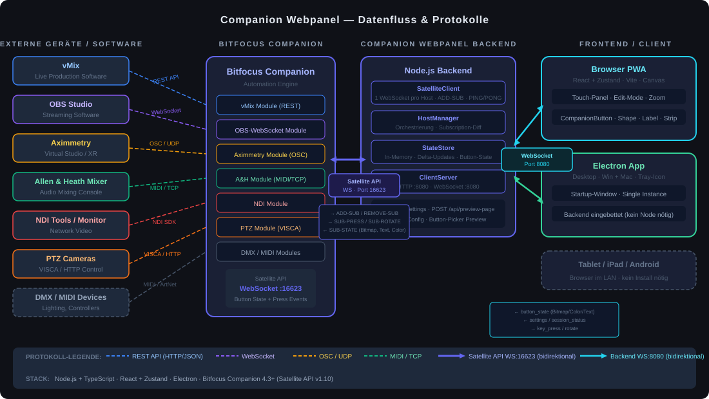

# Companion Webpanel

A real-time, touch-optimized web panel for [Bitfocus Companion](https://bitfocus.io/companion) — designed for live production environments like streaming, broadcast, and AV shows.

Available as a **browser PWA** (reachable from any device on the LAN) and as a standalone **Electron desktop app** for Windows and macOS.

---

## A Note on How This Was Built

This project is **fully vibe-coded** — the entire codebase was written by AI (Claude) based on my specifications, direction, and review. I want to be transparent about that.

This doesn't mean the project was thrown together casually. It grew out of a real production problem: when you run a live show with Bitfocus Companion, the number of controlled functions grows fast — vMix, OBS, Allen & Heath mixers, PTZ cameras, NDI, lighting, all at once. Physical StreamDecks become cluttered and hard to navigate under pressure. During a live broadcast you need to find the right button in seconds, not hunt across six pages.

I have hands-on experience with the interfaces and APIs involved — Satellite API, WebSocket protocols, production device control — and every architectural decision in this project was deliberately chosen and validated by me. The AI was the implementation tool; the domain knowledge, product design, and quality control behind it are mine.

---

## Screenshot



---

## What it does

Companion Webpanel connects to Bitfocus Companion's **Satellite API** and mirrors any configured Companion buttons in real time — including bitmaps, background colors, and text overlays. Button presses are routed back to Companion instantly.

**Why it exists:** Companion controls your entire production stack (vMix, OBS, Allen & Heath mixers, Aximmetry, PTZ cameras, NDI, lighting, …), but its built-in web remote is limited. This panel gives you a fully customizable, touch-friendly surface that works on any screen in your LAN — no extra hardware required.

---

## Data Flow & Protocols

The diagram below shows how signals travel from your production devices through Companion to the panel.



### Protocol overview

| Connection | Protocol | Details |
|---|---|---|
| vMix → Companion | REST API | HTTP/JSON, bidirectional control |
| OBS Studio → Companion | WebSocket | obs-websocket v5 |
| Aximmetry → Companion | OSC / UDP | Open Sound Control |
| Allen & Heath mixer → Companion | MIDI / TCP | SQ/DLive NRPN or TCP protocol |
| PTZ Cameras → Companion | VISCA / HTTP | Serial or IP control |
| DMX / Lighting → Companion | ArtNet / sACN | USB MIDI controllers also supported |
| **Companion ↔ Backend** | **Satellite API · WS :16623** | Button state (bitmap, color, text), key-press, rotation events |
| **Backend ↔ Browser / Electron** | **WebSocket · WS :8080** | Delta state updates, settings, session status |

---

## Architecture

```
[Production Devices]          [Bitfocus Companion]          [Companion Webpanel]
                                                         ┌─── Node.js Backend
 vMix         ──REST──►┐                                 │     SatelliteClient (1 per host)
 OBS Studio   ──WS────►│                                 │     HostManager (subscription diff)
 Aximmetry    ──OSC───►│◄── Satellite API ──►────────────┤     StateStore (in-memory delta)
 Allen&Heath  ──MIDI──►│       WS :16623                 │     ClientServer (HTTP + WS :8080)
 PTZ Cameras  ──VISCA─►│                                 └─── React Frontend (PWA)
 DMX / MIDI   ──Art───►┘                                       Canvas · Edit-Mode · Touch-UX
                                                               Electron wrapper (Win + Mac)
```

**Key design decisions:**
- **One WebSocket connection per Companion host** — all button subscriptions share a single connection (no ADD-DEVICE overhead)
- **Button Subscriptions API** (Companion 4.3+ / Satellite API v1.10) — only subscribed buttons send state updates
- **Backend as state broker** — caches all button states, sends only deltas to connected clients
- **Frontend is stateless** — re-renders only what changes, works from any browser with no install

---

## Canvas Elements

All elements are freely positionable, resizable, and snap to grid. Each has its own properties panel.

### 🎛️ Companion Button
The core element — mirrors a live Companion button in real time.
- Real-time bitmap, background color, and text overlay from Companion
- Configurable text alignment, font size, and scale
- **Physical button style** — metallic frame with concave dome surface, tinted by Companion's background color
- Press animation (scale on touch/click), instant key-press routing back to Companion

### 🎚️ Channel Strip
A full audio mixer channel mapped to Companion actions.
- Vertical fader via touch/drag → sends rotation events to Companion (e.g. controls vMix/A&H fader)
- VU meter L/R with peak hold and clip LED
- Mute, Solo (optional), Pan control (optional) — each mapped to a Companion button ref
- Configurable: show/hide scroll wheel, solo section, pan section

### 🖥️ Virtual Companion Deck
An embedded grid of Companion buttons rendered as a full surface.
- Configurable columns × rows — each cell subscribes independently
- Shared render settings: bitmap scaling, background color, text alignment, empty button color
- Useful for full-page button grids without placing buttons individually

### ⬛ Shape
A visual grouping rectangle — purely decorative, always behind other elements.
- Fill color, stroke color, border radius
- 8 canvas texture options (carbon, linen, metal, …)

### 🔤 Label
Static text for annotating sections of your panel.
- Configurable color, font size, font family, and text alignment
- Does not interact with Companion

---

## Features

### Panel Canvas
- **Edit mode**: drag & drop, resize with snap-to-grid, rubber-band multi-select, undo/redo (Ctrl+Z/Y), duplicate (Ctrl+D)
- **View mode**: touch-optimized, instant button press, no accidental drag
- Zoom in/out with Ctrl+Scroll or pinch gesture
- Canvas size: configurable with presets or custom pixel dimensions, DPI-aware

### Multi-Panel & Multi-Host
- Multiple named panels per settings file, switchable from toolbar
- Multiple Companion hosts with live connection status indicators per host
- Automatic reconnect with exponential backoff

### Electron Desktop App
- Single-instance, system tray icon with connection status
- Embedded backend (no separate Node process needed)
- Startup window shows version and connection status
- Builds for Windows (NSIS installer) and macOS (DMG)

---

## Requirements

- **Bitfocus Companion 4.3.0 or newer**
- In Companion settings: `satellite_subscriptions_enabled = true`
- Node.js 18+ (for development / standalone mode)

---

## Quick Start

```bash
# 1. Configure your Companion host
# Edit CompanionWebpannelSettings.json → hosts[0].host = your-companion-ip

# 2. Install dependencies
npm install

# 3a. Development (browser at http://localhost:5173 + backend at :8080)
npm run dev

# 3b. Electron development mode
npm run electron:dev

# 4. Build release installer (Win + Mac)
npm run release
```

---

## Tech Stack

| Layer | Technology |
|---|---|
| Backend | Node.js · TypeScript |
| Frontend | React · Zustand · Vite · TypeScript |
| Styling | CSS-in-JS (inline styles) |
| Desktop | Electron |
| Drag & Drop | @dnd-kit |
| Monorepo | npm workspaces (`@cwp/shared`, `@cwp/backend`, `@cwp/frontend`, `@cwp/electron`) |
| Tests | Vitest |

---

## Project Structure

```
CompanionWebpannel/
├── packages/
│   ├── shared/src/types.ts          — shared TypeScript types
│   ├── backend/src/
│   │   ├── satellite/               — Satellite API WebSocket client
│   │   ├── state/                   — in-memory button state store
│   │   └── server/                  — HTTP + WebSocket server (:8080)
│   ├── frontend/src/
│   │   ├── components/              — Canvas, Elements, Toolbar, Modals
│   │   ├── store/                   — Zustand state management
│   │   └── ws/                      — WebSocket hook with auto-reconnect
│   └── electron/src/                — main, preload, tray, startup window
├── docs/
│   ├── dataflow.svg                 — protocol & architecture diagram
│   ├── decisions.md                 — all architectural decisions
│   ├── design-system.md             — colors, typography, keyboard shortcuts
│   └── satellite-api-protocol.md   — full Satellite API reference (v1.10)
└── CompanionWebpannelSettings.json  — runtime configuration
```

---

## License

[The Unlicense](LICENSE) — public domain. Do whatever you want.
